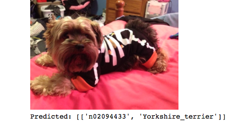

[Back to profile.](http://mgallow.github.io)

# Cat-Dog Image Classifier

## **(Documentation in progress)

## Introduction

**Disclaimer**: This tutorial is highly based off of Francois Chollet's blog post: https://blog.keras.io/building-powerful-image-classification-models-using-very-little-data.html

In this tutorial we create a cat vs. dog image classifier using the python deep learning library Keras. Keras is a wrapper that works on top of Tensorflow or Theano. I have constructed the following using the Tensorflow backend - though the steps should be similar (if not, identical) should you choose to use the Theano backend.

### Files:

- blah

### Why do we care?

### Requirements

This tutorial assumes basic knowledge of neural networks, specifically convolutional neural networks. Check out this excellent [blog post](http://cs231n.github.io/convolutional-networks/) on CNN's by [Andrej Karpathy](http://cs.stanford.edu/people/karpathy/) if needed. I would also recommend taking a look at this [tutorial](http://neuralnetworksanddeeplearning.com) by [Michael Nielsen](http://michaelnielsen.org) for a general overview of neural networks.

**Software**:
- Python 2.7, 3.5
- Keras is available via pip or [Github](https://github.com/fchollet/keras)

## Bottleneck Features

## Fine-Tuning

## Acknowledgements

- Keras documentation: https://keras.io
- This tutorial is highly based off Francois Chollet's blog post: https://blog.keras.io/building-powerful-image-classification-models-using-very-little-data.html

[Back to profile.](http://mgallow.github.io)
